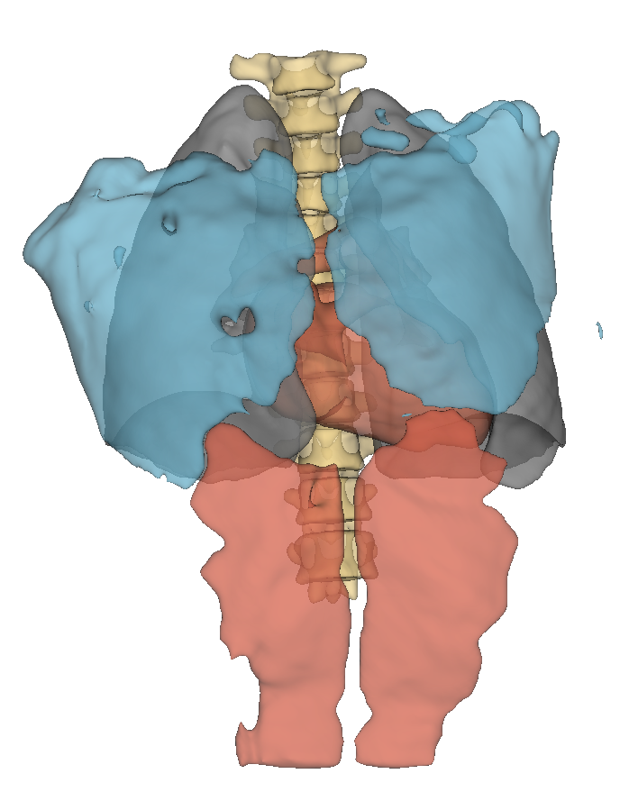

# Summary

To support personalized medicine, we present Organ-omics, an automated organ-radiomics extraction pipeline developed to be used with Python. Building on top of PyRadiomics for radiomics extraction and TotalSegmentator (TS) for automatic organ contouring, this tool extends the path to precision medicine.
Starting from a NifTi formatted dataset and a configuration file (JSON format), this tool allows a user to define a set of organs to be contoured using TotalSegmentator. Using the config file, the user can define organ groups, which can include multiple organs available in TS. All freely available TS tasks can be used and combined to create unique sets of organs. Some TS tasks require a license (see [here](https://backend.totalsegmentator.com/license-academic/)) which must be setup after TS is installed.
A spacing can also be defined in the config file, which will be used to resample images and masks before the features are computed.


# Statement of need

Radiomics derived from lesions are widely used in medical imaging studies, but this lesion-based approaches have limitations: contouring is uncertain, poorly reproducible[ref interobserver] and a limited amount of information is provided using this method.

Prior work [refSalimi et al.] has shown that surrounding tissue and organs carry a signal that is important for patient prognosis and that including organ-based radiomic features can improve the predictive performance of ML algorithms for outcomes such as Overall Survival (OS). To name these organ-based radiomics they used the name organomics.

To our knowledge, there is no freely available end-to-end pipeline that automates organ-based radiomics extraction from medical imaging datasets. Organ-omicsfills this gap by providing an automated and configurable Python pipeline which (1) generates organ contours using TS (2) groups organs according to a user-defined configuration and (3) extracts reproducible organ-level radiomic features using PyRadiomics.

Organ-omics is intended to accelerate research on organ-based radiomics and to improve reproducibility across studies.

# Overview of Organ-omics
Organ-omics is a command line Python package which extracts a CSV table of organ-level radiomic features. A user provides a JSON configuration file (see below) that specifies which segmentation tasks from TS should be used and how labels should be grouped to form the final labels: organ groups. 

The pipeline then runs TS efficiently by limiting the organs to the necessary minimun (through roi_subset, when available) and assembles labels according to the configuration.

**Command:** `Organomics_contour_dataset -d [path_to_dataset] -o [path_to_labels_output] --json-file [path_to_JSON_file]`

A second step computes the 107 organ-level radiomic features for each organ group using PyRadiomics and stores them in a single CSV file. This radiomics extraction can be configured to resample the data to a common isotropic spacing to comply with the IBSI standard.


**Command:** `Organomics_extract_organomics -d [path_to_dataset] -o [path_to_csv_output] --json-file [path_to_JSON_file]`

Organ-omics uses NIfTi at every step and can be integrated into larger preprocessing workflows or used as a standalone tool for organ radiomics studies.


# Stopped Here

## Technical overview

### Key Features
 - **User-defined configuration**: Parse a user-defined configuration from a json file. Labels to extract and organ groups are defined in this file.

 - **Adaptive organ contours extraction**: Using the user-defined configuration, TS is used on the CT images efficiently (i.e.: when possible, the *roi_subset* parameter is defined to limit runtime). Still using this configuration, organs are gathered in groups and the final organ groups multi-label map is generated.
 
   
 
 - **Radiomic features extraction**: 107 radiomic features per Region Of Interest (ROI) are extracted using the PyRadiomics library. Additional info is pulled from the configuration file to comply with the IBSI standard:
   -  *Isotropic spacing*: it is possible not to define it, or to use an anisotropic spacing. However a warning will be issued since this breaks IBSI compliance
  These features are stored in a CSV file with *n_cases* rows and  *n_features* columns.


### Applications and Limitations
#### Pre-requisite

A pre-requisite to Organ-omics is a specific dataset format:

 - All images must be in **NifTi file format**

 - The following **dataset structure** must be respected:
  
  
  ```
|-root_folder
    |-imagesTr
      |-P01_0000.nii.gz
      |-P01_0001.nii.gz
      |-...
    |-labelsTr

```

To get the most from Organ-omics, the Field Of View (FOV) during acquisition should be:
 - As broad as possible: to include the most organs
 - The same for all patients: if an organ is cropped in a patient's scan, the radiomic features might be incorrect (e.g.: Volume, Sphericity, Maximum). If an organ is completely out of FOV, missing values will be introduced, which will impact the performance of downstream tasks.

Organ-omics enables the exploration by clinicians and other researchersof the healthy organs' impact on patient survival and treatment response. It moves us one step closer to a completely automated analysis, from patient imaging to treatment personalization.


# Real-World Example



This picture shows organ groups from two TS tasks:

- **heart** (only the heart), **lung**(all lung lobes) and **thoracic vertebrae**(T1-T12) from **total**

- **pectoralis major** (right/left) and **rectus abdominis** (right/left) from **abdominal_muscles**.

This result can be reproduced using [a script available on the repository](https://github.com/Zhack47/Organ-omics/blob/main/examples/paper_example.sh).